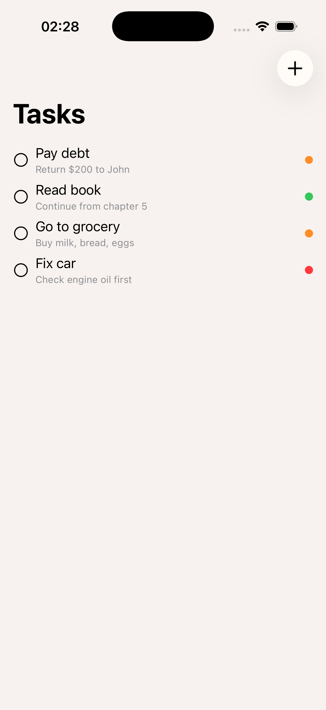
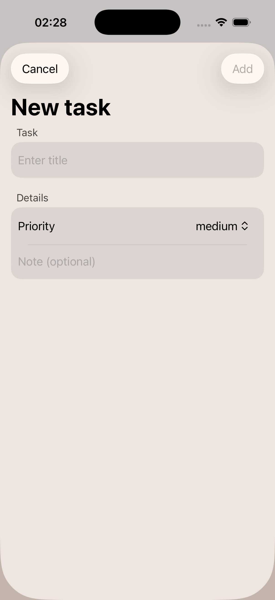

# SwiftData-ToDo-Practice

A practice project built to learn SwiftData, MVVM architecture, and Unit Testing (XCTest). Focus on functionality and code reliability, not design.

## Screenshots

  
  

## Features
- Add tasks with title, note and priority
- Delete task on completion
- Tasks sorted by date (newest first)
- Empty state placeholder
- Data persists between app launches

## Stack
- Swift / SwiftUI
- SwiftData
- XCTest (Unit Testing)
- MVVM

## Testing
The project features a dedicated Unit Testing suite built with `XCTest`.

## Planned Features
- Display completed tasks separately

## Requirements
- iOS 17+
- Xcode 15+
